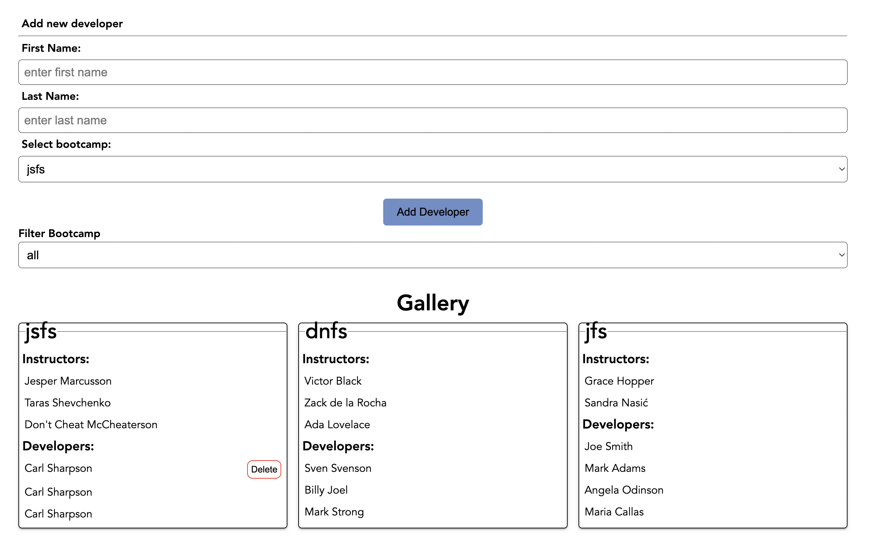

# React Project

Project designed during bootcamp for training of React skills following the instructions below.

## React - Instructors & Developers

We have supplied you with a backend server, so this is a frontend test only. You need to follow the specifications as detailed below. Use the screenshot at the bottom of this page as a wireframe.

### UI specifications

#### Adding Developers

- There MUST be a form for adding a new developer.
- The form MUST contain two inputs, one for a first name and one for a last name.
- There MUST also be a select box in the form where the user can choose which bootcamp to add the developer to.
  - Bootcamps:
    - jsfs
    - jfs
    - dnfs
- When the user submits a new developer from the form the developer MUST appear in the list of developers in the correct bootcamp item without a page reload.
- It MUST be easy to add, toggle and remove developers. For example adding a new developer by hitting the 'Enter'-button.
- An error message MUST be displayed to the user if the user tries to add a developer with invalid input values, according to the e2e test.

#### Displaying Bootcamps

- There MUST be a gallery that displays the bootcamp sections.
- There MUST be a bootcamp section for each bootcamp.
- Each bootcamp section MUST display the name of the bootcamp, a list of instructors and a seperate list of developers.
- There MUST be a select box that the user can use to filter which bootcamps are displayed.
- The selection list MUST have options:
  - all
  - jsfs
  - jfs
  - dnfs
- Each developer item MUST be toggleable and when the user clicks the developer item a delete button MUST appear. When the user clicks this button the item MUST be deleted instantly from the list without reloading the page.
- The different bootcamp items SHOULD be easy to visually separate.
- The instructors list and the developers list SHOULD be easy to visually separate.

|  |
| :-------------------------: |
| Example of this application |

### Technical specifications

- Your application MUST be written in TypeScript
- You MUST keep the fetched data in a state object and you SHOULD fetch the data on initial mount.
- You MUST NOT store the data in LocalStorage.
- You MUST use functional components.
- You MUST use at least 4 levels of components (for an example see the figure at the end).
- You MUST reuse the same component for both instructor & developer items
- You MUST use `props` for passing the necessary information between components. You MUST NOT use React Router, useContext nor Redux.
- You MUST use Semantic HTML elements.
- You MUST use a clear naming strategy for your css and class names (for example BEM).
- You SHOULD have a mobile first approach.
- You SHOULD have suitable unit tests - we will run your tests, and expect no errors. Make sure that the tests you write pass.

#### Tech specification for test correction

We will run a separate end-to-end-test suite (e2e test) that automate correcting your tests. In order for our automated correction to run properly you will need to use the classes and ids in the list below.

##### Here is what our e2e-tests will check

- to add a new developer we will type in two input fields with class names `addDeveloperFirstNameInput` and class `addDeveloperLastNameInput` then click an element with class `addDeveloperBtn`.
- to see if a developer has been added we will compare the number of children in an element with class `cardList` before and after.
- to see how many bootcamp items are being rendered we will look for an element with class `gallery` and count the elements with class `bootcamp` when the filter selection value shows all the bootcamps.
- we will check how many bootcamp items are being rendered when targeting a selection element with class `selectBootcamp`. When you filter by a bootcamp the number of elements with class `cardList` must be 2.
- we will click a developer item with a class `card`.
- we will look for a button with class `deleteBtn` inside a item with class `toggled`.
- we will look for an element with class `errorMessage` if input values are invalid. If you use a set timeout, make sure to display the message for a min of 1000 ms.

### Handing in the test

Make it work, and then if you have time, make it great!

